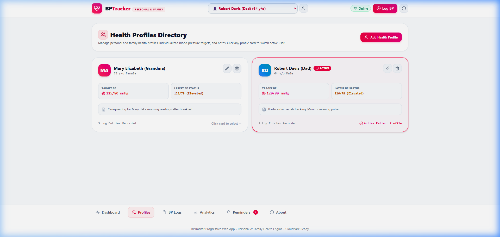
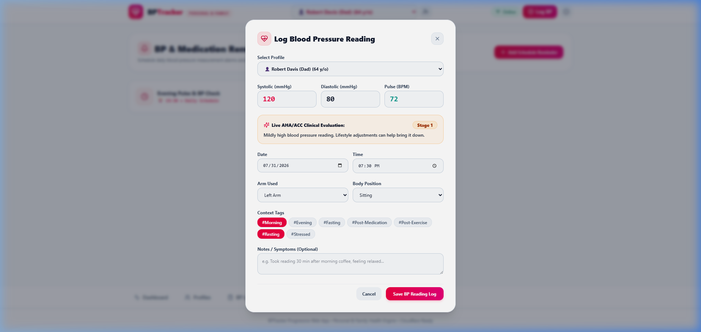
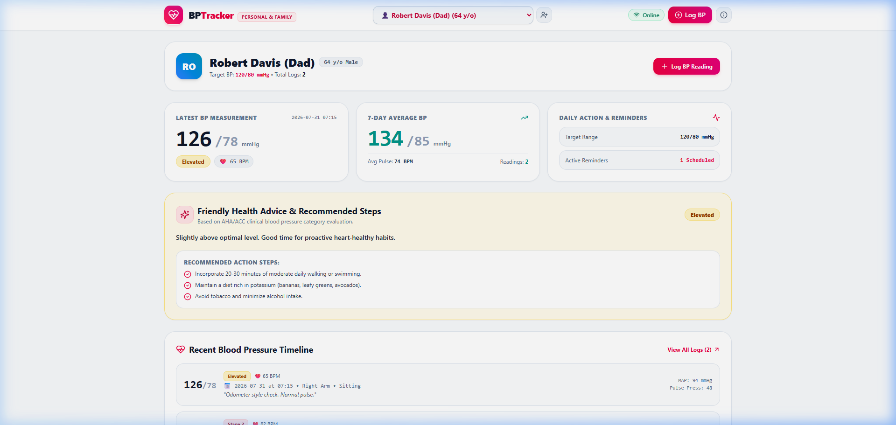
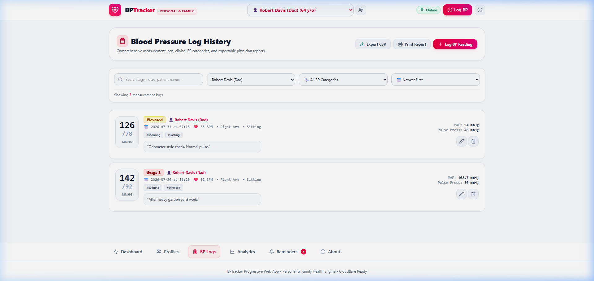
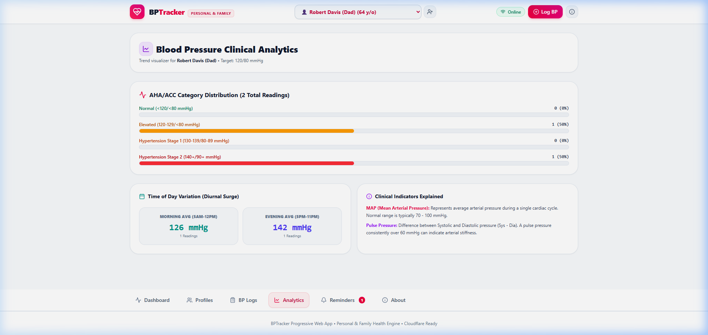
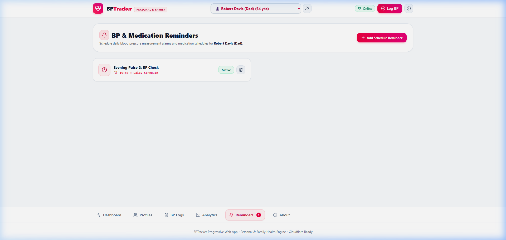

# 🩺 BPTracker - Personal & Family Blood Pressure & Health Advisor PWA

**BPTracker** is a modern, responsive, offline-ready **Progressive Web Application (PWA)** built with **React 19**, **TypeScript 5.8**, **Vite 6**, and **Tailwind CSS 4**, designed to help individuals and families monitor blood pressure measurements, receive clinical AHA/ACC health advice, and export reports for healthcare providers.

---

## 🤖 Built with AI Magic: Antigravity + Gemini 3.6 Flash! 🚀

> *"Zero gravity, maximum velocity, and dragon-fire precision!"* 🐉 🐧

This PWA wasn't just built — it was **hyper-engineered** in pair-programming harmony with **Antigravity**, Google DeepMind's advanced agentic coding platform, powered by **Gemini 3.6 Flash (High)**!

- ⚡ **Lightning Fast Generation**: Component architecture, AHA/ACC clinical advice engines, and responsive glass/light styling crafted at warp speed.
- 🎯 **Zero-Defect Code**: Strict TypeScript 5.8 types, automated build checks, case-sensitivity fixes, and seamless PWA manifests generated in record time.
- 🎨 **Visual Excellence**: Crafted with curated light theme design tokens, vector SVG icons, and a custom dragon-penguin developer avatar.

---

## ✨ Features & Highlights

- 👨‍👩‍👧 **Personal & Family Health Profiles**: Effortlessly track and switch between multiple health profiles (Myself, Grandma, Spouse, Dad) with customized target BP ranges.
- 🩺 **AHA/ACC Blood Pressure Advice Engine**: Classifies readings in real-time into Normal, Elevated, Stage 1, Stage 2, and Hypertensive Crisis with tailored clinical health advice.
- 📊 **Interactive Analytics & Trends**: 7-day rolling averages, Mean Arterial Pressure (MAP), Pulse Pressure, and diurnal morning/evening variation tracking.
- ⏰ **Medication & BP Measurement Alarms**: Set scheduled daily BP check alarms and medication dosage reminders.
- 💾 **Doctor-Ready PDF & CSV Data Export + Native Sharing**: Export formatted clinical PDF reports & CSV spreadsheets, share files directly via native mobile share sheets (Email, WhatsApp, AirDrop, Messages), or backup/restore complete app states via JSON.
- 🎨 **Clean Light Theme UI & Scalable SVG Icon**: Crisp accessible interface, fast touch controls, and high-DPI SVG vector icons.
- 📲 **Installable Progressive Web App (PWA)**: Add to Home Screen on iOS, Android, and Desktop with offline access.
- 🚀 **Cloudflare Pages Deployment**: Optimized SPA build configuration for global edge deployment on Cloudflare Pages.

---

## 📲 How to Install BPTracker on Mobile & Desktop

As a **Progressive Web Application (PWA)**, BPTracker can be installed directly onto your mobile home screen or desktop without needing an App Store or Google Play Store download.

### 🍎 Installing on iOS (iPhone & iPad - Safari)

1. Open **Safari** on your iPhone or iPad and navigate to your hosted app URL (e.g. `https://bptracker.pages.dev`).
2. Tap the **Share** button (the square icon with an upward arrow at the bottom toolbar).
3. Scroll down the Share menu and tap **Add to Home Screen**.
4. Confirm the app title (`BPTracker`) and tap **Add** in the top-right corner.
5. The BPTracker icon will now appear on your iPhone/iPad Home Screen and launch in full-screen standalone mode!

---

### 🤖 Installing on Android (Google Chrome, Brave, Edge)

#### Method 1: In-App Install Banner
1. Open the app URL in **Chrome** on your Android device.
2. Tap the floating **Install BPTracker App** banner that appears at the bottom of the screen.
3. Tap **Install** when prompted.

#### Method 2: Chrome Menu
1. Tap the **three dots menu (⋮)** in the top-right corner of Chrome.
2. Tap **Install app** or **Add to Home screen**.
3. Confirm by tapping **Install**.
4. BPTracker will be added to your Android App Drawer and Home Screen.

---

### 💻 Installing on Desktop (Google Chrome & Microsoft Edge)

1. Open the app URL in **Chrome** or **Edge** on your computer.
2. Click the **Install Icon** (computer screen with a down arrow) located on the right side of the browser address bar (URL bar).
3. Click **Install** in the confirmation popup.
4. BPTracker will open as a standalone window and create a desktop/start menu shortcut.

---

### ⚡ Benefits of Installing BPTracker as a PWA
- **100% Offline Functionality**: Read and log blood pressure measurements anytime, even without cell service or Wi-Fi.
- **Native App Feel**: Opens fullscreen without browser bars or URL controls.
- **Privacy & Speed**: Launches instantly with zero external network dependencies for local data.

---

## 📱 How to Use BPTracker (User Guide & Screenshots)

### 1. 👤 Managing Health Profiles

Switch between yourself and family members, set custom target blood pressure ranges, and add personal notes:
- Click **Profiles** in the navigation bar to open the **Health Profiles Directory**.
- Click any profile card to instantly switch active users.
- Use **+ Add Health Profile** to create a new profile.



---

### 2. 📝 Logging Blood Pressure Readings

Log new measurements with instant clinical feedback:
- Click the **+ Log BP** button in the header or dashboard.
- Enter **Systolic**, **Diastolic**, and **Pulse** values.
- Select **Arm Used** (Left/Right) and **Body Position** (Sitting, Lying, Standing).
- Select context tags (e.g., `#Morning`, `#Fasting`, `#Post-Medication`, `#Resting`).
- Review live **AHA/ACC Clinical Evaluation** feedback before saving.



---

### 3. 📊 Dashboard Overview & Health Advice

View a comprehensive snapshot of active profile vitals:
- **Latest Measurement**: Displays your most recent reading with color-coded AHA category badges.
- **7-Day Rolling Average**: Automatically calculates your 7-day average blood pressure and pulse.
- **Friendly Health Advice**: Provides actionable clinical guidance and recommended lifestyle steps based on AHA/ACC guidelines.
- **Hypertensive Crisis Warning**: Prominently alerts you if a reading exceeds 180/120 mmHg.



---

### 4. 📋 Reviewing Logs & Exporting Physician Reports

Review, search, and export blood pressure history:
- Filter entries by **Profile**, **AHA Category**, or **Date / Systolic Sort**.
- Search notes and context tags in real time using the search bar.
- Click **Export CSV** to download a spreadsheet formatted for doctor visits.
- Click **Print Report** for a clean printout of your logs.



---

### 5. 📈 Clinical Analytics & Diurnal Variation

Analyze blood pressure trends and cardiac indicators:
- **Category Distribution**: View progress bars showing percentage breakdown across Normal, Elevated, Stage 1, Stage 2, and Crisis ranges.
- **Diurnal Surge Variation**: Compare morning (5 AM – 12 PM) vs. evening (5 PM – 11 PM) average systolic pressures.
- **Clinical Explanations**: Learn about **Mean Arterial Pressure (MAP)** and **Pulse Pressure** indicators.



---

### 6. ⏰ Setting Alarms & Medication Reminders

Never miss a measurement or medication dose:
- Navigate to the **Reminders** tab.
- Click **+ Add Schedule Reminder**.
- Set daily alarm times for morning/evening BP checks or medication intake (with optional dosage details).



---

## 🚀 How to Host on Cloudflare Pages

BPTracker is fully optimized for **Cloudflare Pages** edge hosting. You can deploy it either via **GitHub Integration (Continuous Deployment)** or directly via **Wrangler CLI**.

### Option A: GitHub Integration (Recommended for Automated CD)

1. **Push Repository**: Ensure your latest changes are pushed to GitHub (`https://github.com/lyvuong/BPTracker`).
2. **Log in to Cloudflare**: Go to the [Cloudflare Dashboard](https://dash.cloudflare.com/) and navigate to **Workers & Pages**.
3. **Create Pages Project**:
   - Click **Create Application** → **Pages** → **Connect to Git**.
   - Select your GitHub account and authorize access to the `BPTracker` repository.
4. **Configure Build Settings**:
   - **Project Name**: `bptracker` (or your preferred name)
   - **Production Branch**: `main`
   - **Framework Preset**: `Vite` (or `None`)
   - **Build Command**: `npm run build`
   - **Build Output Directory**: `dist`
5. **Set Node.js Version**:
   - Expand **Environment Variables (Advanced)**.
   - Add a variable: `NODE_VERSION` = `20` (Cloudflare Pages will also automatically detect Node 20 from `.nvmrc`).
6. **Deploy**: Click **Save and Deploy**. Cloudflare will build the Vite bundle and deploy it globally to a `*.pages.dev` domain in under 30 seconds!

---

### Option B: Deploy via Wrangler CLI (Command Line)

You can also deploy directly from your local terminal using Cloudflare's Wrangler CLI:

```bash
# 1. Install Wrangler CLI (if not already installed)
npm install -g wrangler

# 2. Build production bundle
npm run build

# 3. Deploy dist output folder to Cloudflare Pages
npx wrangler pages deploy dist --project-name=bptracker
```

---

### ℹ️ SPA Routing Note (`public/_redirects`)

Cloudflare Pages automatically reads `public/_redirects` included in this repository:
```text
/*  /index.html  200
```
This ensures client-side React routes and direct page refreshes resolve cleanly without `404 Not Found` errors.

---

## 🛠️ Technology Stack

- **AI Pair Programmer**: Google DeepMind Antigravity + Gemini 3.6 Flash (High) ⚡
- **Core**: React 19, TypeScript 5.8, Vite 6
- **Styling**: Tailwind CSS 4, Lucide Icons, Clean Light Design System
- **Hosting**: Cloudflare Pages (`public/_redirects` SPA rules)

---

## 💻 Local Development Setup

```bash
# Clone the repository
git clone https://github.com/lyvuong/BPTracker.git

# Navigate to project directory
cd BPTracker

# Install dependencies
npm install

# Start local dev server
npm run dev

# Build for production
npm run build
```

---

## 👨‍💻 Developer & Author

- **Developer**: Ly Vuong (🐉 🐧 Dragon & Penguin Fan)
- **AI Pair Programmer**: Google DeepMind **Antigravity** (Gemini 3.6 Flash) ⚡
- **Repository**: [https://github.com/lyvuong/BPTracker](https://github.com/lyvuong/BPTracker)
- **License**: MIT
